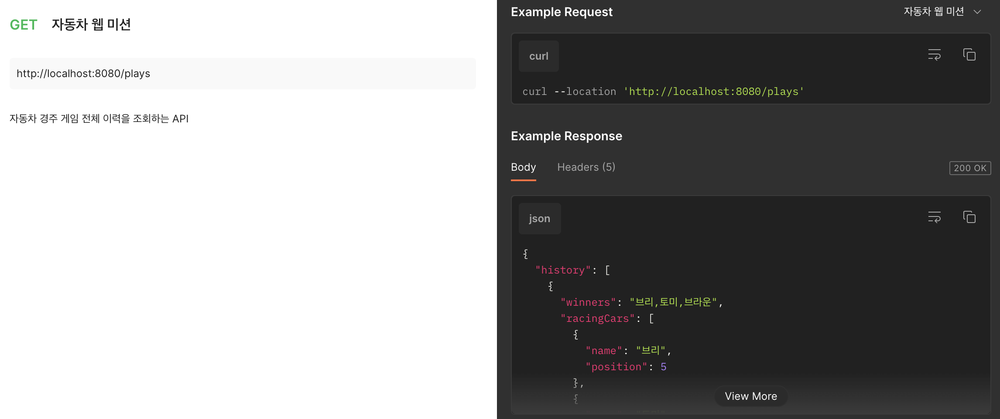

# jwp-racingcar

## ✔️ 기능 요구사항

- [x] 자동차 경주 코드 가져오기

### 웹 구현

- [x] 자동차 경주 게임 실행 웹 요청 구현
- [x] 자동차 경주 게임 실행 웹 응답 구현
- [x] 자동차 경주 게임 전체 이력 조회 웹 요쳥 구현
- [x] 자동차 경주 게임 전체 이력 조회 웹 응답 구현

### DB 연동

- [x] DB 연동하기
  - [x] `H2 데이터베이스` 연동하기
  - [x] 자동차 경주 게임 플레이 이력 저장
    - [x] `DB 테이블 스키마` 구현 
      
### DAO

- [x] Game 정보를 관리하는 DAO 기능 구현
  - [x] Game 정보를 저장하기 위한 InsertGameEntity 기능 구현
  - [x] Game 정보를 조회하기 위한 SelectGameEntity 기능 구현
- [x] Winner 정보를 관리하는 DAO 기능 구현
  - [x] Winner 정보를 관리하는 WinnerEntity 기능 구현
- [x] Car 정보를 관리하는 DAO 기능 구현
  - [x] Car 정보를 전달하는 CarEntity 기능 구현

## API

[링크](https://documenter.getpostman.com/view/19879275/2s93XvVQA1)
에서도 확인하실 수 있습니다.

### 자동차 경주 게임 실행 API

### 자동차 경주 전체 이력 조회 API

## DB 테이블

