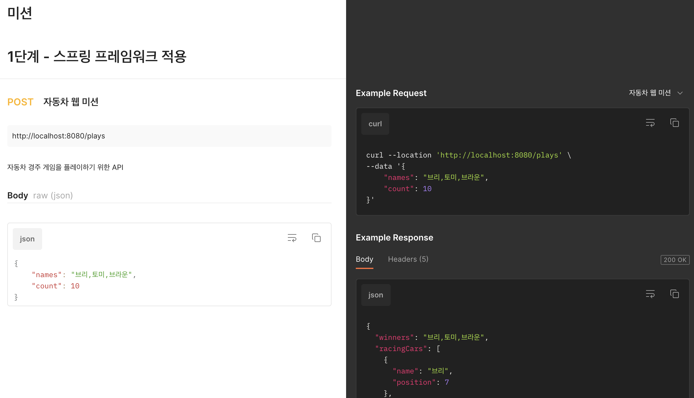
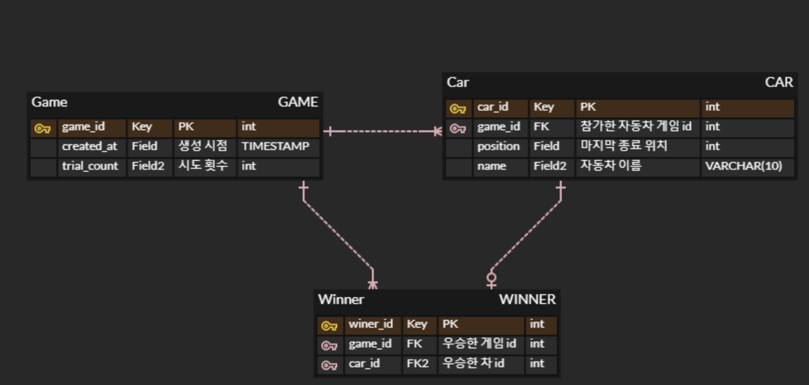

# jwp-racingcar

## ✔ 2단계 기능 요구사항

- [x] GET /plays 를 통해 지금까지 발생했던 모든 결과들을 조회한다

## 콘솔 구현

- [x] 기존 코드 출력 방식 변경
- [x] 기존 코드를 재활용하여 중복을 줄이는 방향으로 리팩토링한다

## ✔️ 기능 요구사항

- [x] 자동차 경주 코드 가져오기

### 웹 구현

- [x] 자동차 경주 웹 요청 구현
- [x] 자동차 경주 웹 응답 구현

### DB 연동

- [x] DB 연동하기
    - [x] `H2 데이터베이스` 연동하기
    - [x] 자동차 경주 게임 플레이 이력 저장
        - [x] `DB 테이블 스키마` 구현

### DAO

- [x] Game 정보를 관리하는 DAO 기능 구현
- [x] Winner 정보를 관리하는 DAO 기능 구현
- [x] Result 정보를 관리하는 DAO 기능 구현
- [x] Car 정보를 관리하는 DAO 기능 구현
    - [x] Car 정보를 전달하는 CarEntity 기능 구현

## API

[링크](https://documenter.getpostman.com/view/19879275/2s93XvVQA1)에서도 확인하실 수 있습니다.

## DB 테이블

