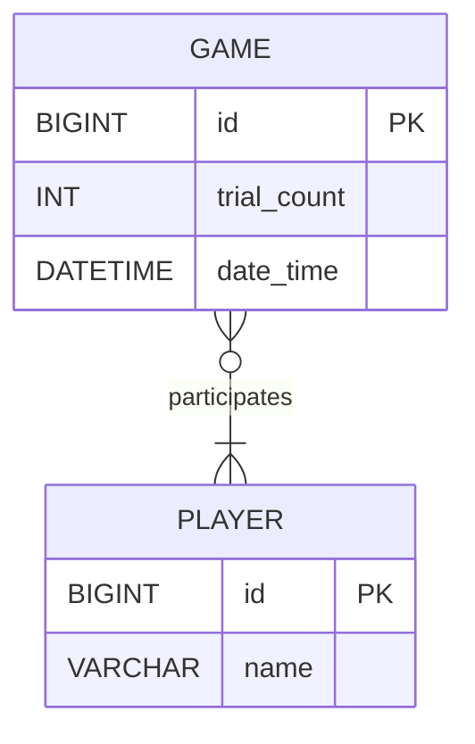
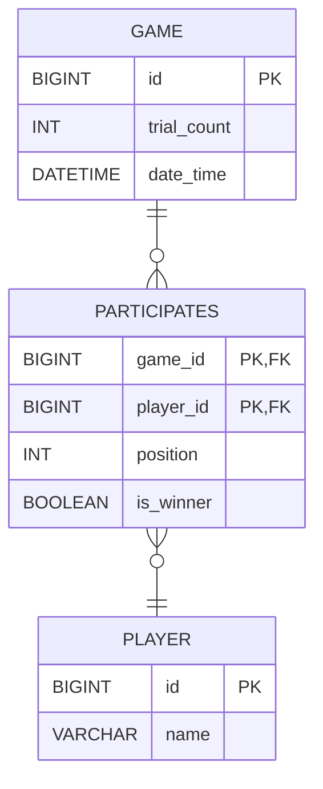

# jwp-racingcar

## 1단계 요구사항
### 1. 요청/응답 구현
- [X] `/plays`로 요청을 받는 컨트롤러 메서드 구현
- [X] 요청/응답 DTO를 구현한다.
  - [X] `이름 목록`과 `시도 횟수`를 요청받는 DTO
  - [X] `우승자들`과 `참여자 결과(이름, 위치)`를 응답하는 DTO

### 2. 테이블 설계
- [x] 시도횟수를 저장한다.
- [x] 플레이어 별 최종 이동거리와 이름을 저장한다.
- [x] 우승자들을 저장한다.
- [x] 플레이한 날짜/시간을 저장한다.

### 3. DB 연동
- [x] 데이터베이스 의존성 추가 및 설정
- [x] 결과 저장 DAO 구현
  - [x] `JdbcTemplate`사용

## DB 설계
### ERD (N:M)

### ERD (N:M -> 1:N & 1:N)

---

## 2단계 요구사항

### 0. 1단계 피드백 반영
- [x] `Exception` 핸드링 기준 변경
- [x] restful 한 api 작성을 위해 행위와 자원을 명확하게 표현
- [x] Service 내부 책임 분리
- [x] 부정 연산자 제거
- [x] `@ParameterizedTest`로 테스트할 때 `@DisplayName` 삭제
- [x] 비즈니스 로직을 수행 중 예외가 발생할 경우 롤백하기 위해 `@Transactional` 적용

### 1. 게임 플레이 이력 조회 API 구현
- [x] `/plays`로 GET 요청을 받는 API 구현
  - [x] `getPlays` Controller 구현
  - [x] 이력 조회하는 Service 구현
  - [x] GameDao : `findId` 메서드 구현
  - [x] ParticipatesDao : `findByGameId` 메서드 구현
  - [x] PlayerDao : `findNameById` 메서드 구현

### 2. 기존 기능 수정 - 출력 방식 수정

- [x] console application에 해당하는 코드 다시 가져오기
- [x] console application에서 플레이의 중간 과정을 출력하는 로직 제거
- [x] web application과 동일하게 우승자와 player 별 최종 이동거리를 출력하도록 수정

### 3. 리팩터링 - 중복 코드 제거

- [x] 비즈니스 로직 중복 코드 제거
- [x] 기존 자동차 미션 코드 전체적으로 리팩토링

---

## 2단계 리팩토링

- [x] InputView의 inputCarName()에서 문자열을 반환하도록 변경
- [ ] ResultResponse에서 winners를 문자열로 변환하도록 책임 이동
- [ ] ConsoleApplication 의존성 주입 변수 분리
- [ ] @Valid 어노테이션 사용
- [ ] 조회하는 경우 @Transactional 제거
- [ ] 예측하지 못한 예외도 핸들러로 관리
- [ ] SimpleJdbcInsert 사용
- [ ] 사용하지 않는 주석 제거
- [ ] 의미있는 클래스 명으로 변경
- [ ] service에서 domain으로 책임 이동
