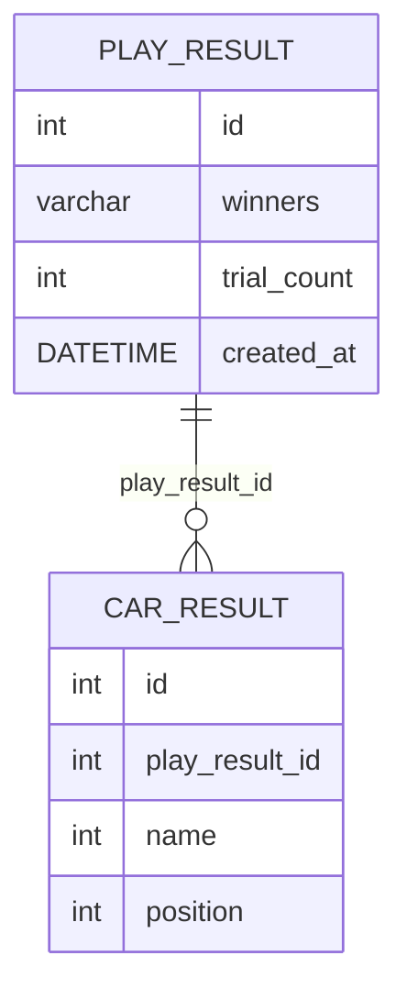

# jwp-racingcar

# 요구사항

## 입력
- [x] 자동차 이름 입력
- [x] 게임 시도 횟수 입력

## 자동차 경주 게임
- [x] 자동차 경주 게임 실행
  - [x] 자동차 파워 생성
  - [x] 자동차 파워만큼 전진
- [x] 우승한 자동차 이름 반환
- [x] 자동차별 최종 포지션 반환

# DDL

```sql
CREATE TABLE PLAY_RESULT
(
    id          INT         UNSIGNED NOT NULL AUTO_INCREMENT,
    winners     VARCHAR(120) NOT NULL,
    trial_count INT         NOT NULL,
    created_at  DATETIME    NOT NULL,
    PRIMARY KEY (id)
);

CREATE TABLE CAR_RESULT
(
    id             INT         NOT NULL AUTO_INCREMENT,
    play_result_id INT         NOT NULL,
    name           VARCHAR(10) NOT NULL,
    position       INT         NOT NULL,
    PRIMARY KEY (id),
    FOREIGN KEY (play_result_id) REFERENCES PLAY_RESULT (id) ON DELETE CASCADE
);
```

# DB 구조

