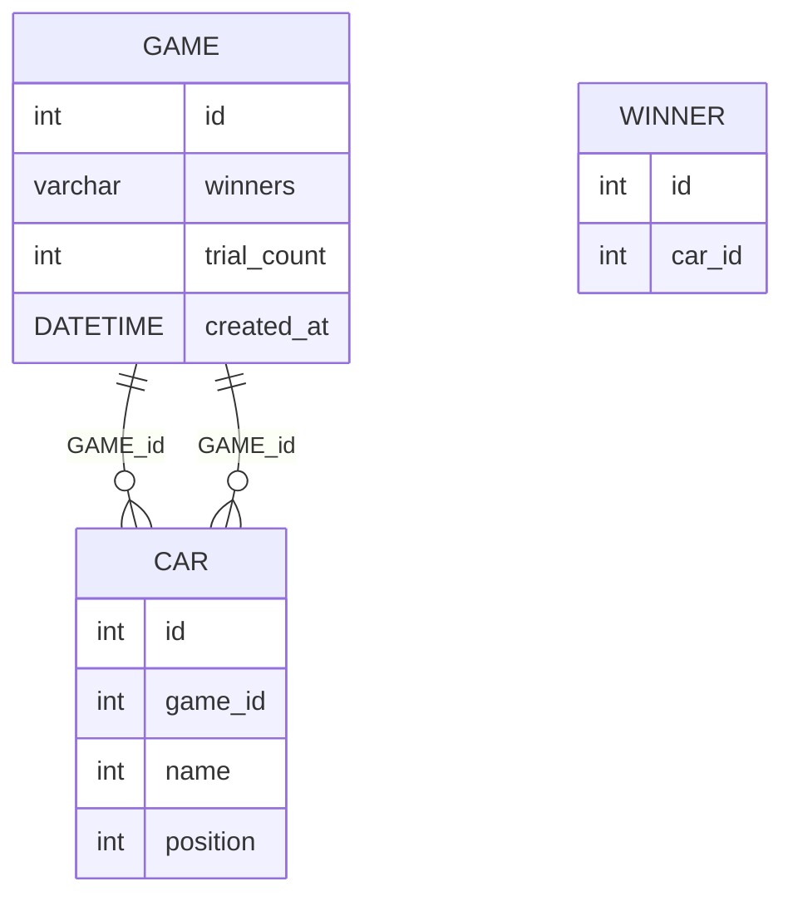

# 요구사항

- [x] 웹 요청/응답 구현하기
    - [x] `/plays`경로로 `POST` 요청을 받는다
    - [x] 요청/응답 DTO 구성

- [x] 요청/응답 DTO 구현
    - [x] 요청
        - [x] 게임 실행
            - [x] 참여자들
            - [x] 시도횟수
    - [x] 응답
        - [x] 게임 결과
            - [x] 우승자
            - [x] 참여자들


- [x] DB 구성
    - [x] 게임 결과를 저장한다
        - [x] 시도횟수
        - [x] 우승자
        - [x] 실행 시간
    - [x] 각 플레이어의 기록을 저장한다.
        - [x] 이름
        - [x] 위치

- [x] 게임 플레이 이력 조회 API 구현
- [x] 기존 기능 수정 - 출력 방식 수정
- [x] 리팩터링 - 중복 코드 제거

# DDL

```sql
DROP TABLE IF EXISTS GAME;
DROP TABLE IF EXISTS CAR;
DROP TABLE IF EXISTS WINNER;

CREATE TABLE GAME
(
    id          INT      NOT NULL AUTO_INCREMENT,
    trial_count INT      NOT NULL,
    created_at  DATETIME NOT NULL default current_timestamp,
    PRIMARY KEY (id)
);

CREATE TABLE CAR
(
    id       INT         NOT NULL AUTO_INCREMENT,
    game_id  INT         NOT NULL,
    name     VARCHAR(50) NOT NULL,
    position INT         NOT NULL,
    PRIMARY KEY (id),
    foreign key (game_id) references GAME (id)
);

CREATE TABLE WINNER
(
    id     INT NOT NULL AUTO_INCREMENT,
    car_id INT NOT NULL,
    PRIMARY KEY (id),
    foreign key (car_id) references CAR (id)
);
```

# DB 구조



# Web Api

| PATH  | HTTP Method | RETURN VALUE                                   |
|-------|-------------|------------------------------------------------|
| plays | POST        | { winners, racingCars [ { name, position } ] } |
